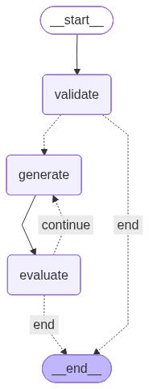
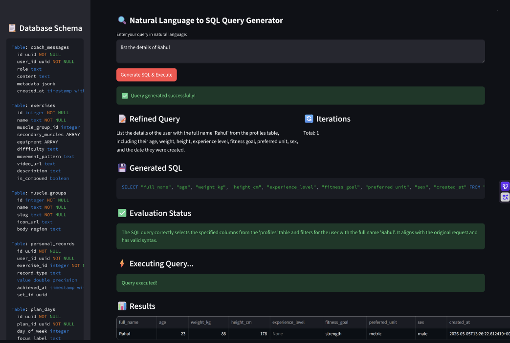

# 🔍 NL to SQL Query Generator

A powerful, multi-agent system built with **LangGraph** and **Streamlit** that converts natural language questions into accurate, executable SQL queries. The system features a robust feedback loop between specialized agents to ensure query correctness and security.

## 🚀 Key Features

### 1. Multi-Agent Orchestration
The system uses a sophisticated LangGraph workflow consisting of three specialized agents:
- **Validator Agent**: Analyzes the user's intent to ensure the query is relevant to the database schema and refines the natural language for better SQL generation.
- **Generator Agent**: Translates the refined natural language into optimized SQL queries.
- **Evaluator Agent**: Tests the generated SQL against the actual database, provides feedback, and triggers revisions if errors occur.

### 2. Dynamic DB Schema Discovery
The application automatically fetches the latest database schema directly from **Supabase**. This ensures the agents always have the most up-to-date information about tables, columns, and data types without manual configuration.

### 3. Smart Validation & Error Handling
Queries are strictly validated before generation. If a user asks something out-of-context (e.g., "What's the weather?"), the system rejects it gracefully, explaining why it cannot fulfill the request based on the current database scope.

### 4. Self-Correcting Loop (Iterative Refinement)
If the Evaluator detects a syntax error or a logical mismatch, it sends feedback back to the Generator. The system will iterate up to a defined limit (`MAX_ITERATIONS`) to fix the query autonomously.

### 5. Live Frontend Schema Display
The Streamlit sidebar provides a live view of the database schema, allowing users to see exactly what data they can query.

---

## 📸 Demo & Screenshots

### Workflow Visualization
Below is the agentic workflow generated using Mermaid. It shows the path from validation to the iterative generation/evaluation loop.


*Description: The LangGraph workflow starting with validation, followed by a conditional loop between SQL generation and evaluation.*

### Intelligent Query Validation

*Description: The Validator Agent protects the system by rejecting out-of-context queries (e.g., sports questions for a fitness database) and providing helpful guidance to the user.*


### Complex Join Queries

*Description: Demonstrating the system's ability to handle complex relational logic, such as joining `job_descriptions` and `generated_contents` based on foreign key relationships.*

### Detailed Entity Queries

*Description: The system can handle specific entity lookups, retrieving detailed profiles and filtering by attributes as demonstrated in this query for user details.*


## 🛠️ Technical Stack
- **Framework**: [LangGraph](https://github.com/langchain-ai/langgraph)
- **Frontend**: [Streamlit](https://streamlit.io/)
- **Database**: [Supabase](https://supabase.com/) (PostgreSQL)
- **Language**: Python 3.14+
- **Environment Management**: `uv`

## ⚙️ Setup & Installation

1. **Clone the repository**
2. **Install dependencies**:
   ```bash
   uv sync
   ```
3. **Configure Environment**:
   Create a `.env` file with your Supabase credentials:
   ```env
   SUPABASE_URL=your_url
   SUPABASE_SERVICE_ROLE_KEY=your_key
   OPENAI_API_KEY=your_key
   ```
4. **Run the Application**:
   ```bash
   uv run streamlit run main.py
   ```
